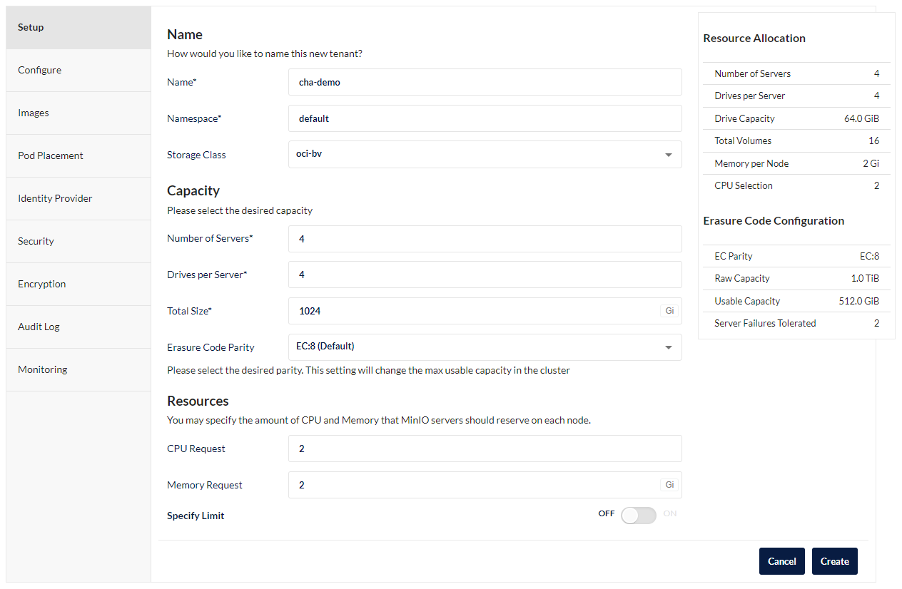

# 2022/6/8開催　OCHaCafe Season5「MLOpsを始めよう！」のデモ資材

## レポジトリ資材の確認


## 環境構築

### 前提条件

* Kubernetes：OKE v1.21.5(v1.22+にはまだ資材が対応していません)
* kustomize：v3.2.0(v4.xを利用するとインストールは成功しますが、インストール時の依存関係でダッシュボードにアクセスできない場合があります)
* kubectl：Kubernetesバージョンに沿ったバージョン

### 1.Kubeflowの構築

#### 1-1. レポジトリのcron

    git clone https://github.com/kubeflow/manifests.git

#### 1-2. Kubeflowのインストール

    while ! kustomize build example | kubectl apply -f -; do echo "Retrying to apply resources"; sleep 10; done

kustomizeコマンドが完了しても、各Podが`Runnning`になるまでしばらくかかるので、待機します。  
全てのPodが起動すると以下のようになります。  

```sh
[opc@client ~]$ kubectl get pods -A
NAMESPACE                   NAME                                                              READY   STATUS    RESTARTS   AGE
auth                        dex-5ddf47d88d-5zz7s                                              1/1     Running   1          6d21h
cert-manager                cert-manager-7b8c77d4bd-ccsdh                                     1/1     Running   0          6d21h
cert-manager                cert-manager-cainjector-7c744f57b5-gkj5n                          1/1     Running   2          6d21h
cert-manager                cert-manager-webhook-fcd445bc4-q9vfm                              1/1     Running   0          6d21h
istio-system                authservice-0                                                     1/1     Running   0          6d21h
istio-system                cluster-local-gateway-64f58f66cb-52xl4                            1/1     Running   0          6d21h
istio-system                istio-ingressgateway-8577c57fb6-mn8dz                             1/1     Running   0          6d21h
istio-system                istiod-6c86784695-tmfvr                                           1/1     Running   0          6d21h
knative-eventing            eventing-controller-79895f9c56-fmw6h                              1/1     Running   0          6d21h
knative-eventing            eventing-webhook-78f897666-6lzsc                                  1/1     Running   0          6d21h
knative-eventing            imc-controller-688df5bdb4-p7q4w                                   1/1     Running   0          6d21h
knative-eventing            imc-dispatcher-646978d797-5xb85                                   1/1     Running   0          6d21h
knative-eventing            mt-broker-controller-67c977497-9f9jw                              1/1     Running   0          6d21h
knative-eventing            mt-broker-filter-66d4d77c8b-rpr6r                                 1/1     Running   0          6d21h
knative-eventing            mt-broker-ingress-5c8dc4b5d7-vw7rd                                1/1     Running   0          6d21h
knative-serving             activator-7476cc56d4-lbbm7                                        2/2     Running   0          6d21h
knative-serving             autoscaler-5c648f7465-74vdd                                       2/2     Running   0          6d21h
knative-serving             controller-57c545cbfb-hv5bk                                       2/2     Running   1          6d21h
knative-serving             istio-webhook-578b6b7654-w7ts5                                    2/2     Running   1          6d21h
knative-serving             networking-istio-6b88f745c-ktkv7                                  2/2     Running   0          6d21h
knative-serving             webhook-6fffdc4d78-4t5bs                                          2/2     Running   1          6d21h
kserve                      kserve-controller-manager-0                                       2/2     Running   0          6d21h
kube-system                 coredns-7554f6fd5b-b7nkn                                          1/1     Running   0          6d21h
kube-system                 coredns-7554f6fd5b-cjlfx                                          1/1     Running   0          6d21h
kube-system                 coredns-7554f6fd5b-wvcf7                                          1/1     Running   0          6d21h
kube-system                 csi-oci-node-78jvd                                                1/1     Running   0          6d21h
kube-system                 csi-oci-node-m8m2m                                                1/1     Running   0          6d21h
kube-system                 csi-oci-node-ppjf5                                                1/1     Running   0          6d21h
kube-system                 kube-dns-autoscaler-5cd75c9b4c-749dv                              1/1     Running   0          6d21h
kube-system                 kube-flannel-ds-4vf2k                                             1/1     Running   0          6d21h
kube-system                 kube-flannel-ds-nbnpq                                             1/1     Running   1          6d21h
kube-system                 kube-flannel-ds-w9shl                                             1/1     Running   1          6d21h
kube-system                 kube-proxy-7b479                                                  1/1     Running   0          6d21h
kube-system                 kube-proxy-ch2sk                                                  1/1     Running   0          6d21h
kube-system                 kube-proxy-nhnz9                                                  1/1     Running   0          6d21h
kube-system                 proxymux-client-9h577                                             1/1     Running   0          6d21h
kube-system                 proxymux-client-gt5hw                                             1/1     Running   0          6d21h
kube-system                 proxymux-client-w9ctk                                             1/1     Running   0          6d21h
kubeflow                    admission-webhook-deployment-7df7558c67-z5j4c                     1/1     Running   0          6d21h
kubeflow                    cache-deployer-deployment-6f4bcc969-wpd8k                         2/2     Running   1          6d21h
kubeflow                    cache-server-575d97c95-mgd9t                                      2/2     Running   0          6d21h
kubeflow                    centraldashboard-79f489b55-r2ldg                                  2/2     Running   0          6d21h
kubeflow                    jupyter-web-app-deployment-5886974887-lqx2d                       1/1     Running   0          6d21h
kubeflow                    katib-controller-58ddb4b856-9t597                                 1/1     Running   0          6d21h
kubeflow                    katib-db-manager-d77c6757f-z9zcm                                  1/1     Running   2          6d21h
kubeflow                    katib-mysql-7894994f88-dt7m6                                      1/1     Running   0          6d21h
kubeflow                    katib-ui-f787b9d88-t8mp4                                          1/1     Running   0          6d21h
kubeflow                    kfserving-controller-manager-0                                    2/2     Running   0          6d21h
kubeflow                    kfserving-models-web-app-7884f597cf-wgdjq                         2/2     Running   0          6d21h
kubeflow                    kserve-models-web-app-5c64c8d8bb-gwk7j                            2/2     Running   0          6d21h
kubeflow                    kubeflow-pipelines-profile-controller-84bcbdb899-ltlp8            1/1     Running   0          6d21h
kubeflow                    metacontroller-0                                                  1/1     Running   0          6d21h
kubeflow                    metadata-envoy-deployment-7b847ff6c5-wb846                        1/1     Running   0          6d21h
kubeflow                    metadata-grpc-deployment-f8d68f687-787c5                          2/2     Running   3          6d21h
kubeflow                    metadata-writer-78fc7d5bb8-lmvtj                                  2/2     Running   3          6d21h
kubeflow                    minio-5b65df66c9-vnqkw                                            2/2     Running   0          6d21h
kubeflow                    ml-pipeline-7bb5966955-w2f4q                                      2/2     Running   1          6d21h
kubeflow                    ml-pipeline-persistenceagent-87b6888c4-hm6mf                      2/2     Running   0          6d21h
kubeflow                    ml-pipeline-scheduledworkflow-665847bb9-kvwfs                     2/2     Running   0          6d21h
kubeflow                    ml-pipeline-ui-554ffbd6cd-cn8hl                                   2/2     Running   0          6d21h
kubeflow                    ml-pipeline-viewer-crd-68777557fb-pp9sf                           2/2     Running   1          6d21h
kubeflow                    ml-pipeline-visualizationserver-66c54744c-rxkjf                   2/2     Running   0          6d21h
kubeflow                    mysql-f7b9b7dd4-slcth                                             2/2     Running   0          6d21h
kubeflow                    notebook-controller-deployment-7474fbff66-cdslp                   2/2     Running   1          6d21h
kubeflow                    profiles-deployment-5cc86bc965-jhr74                              3/3     Running   1          6d21h
kubeflow                    tensorboard-controller-controller-manager-5cbddb7fb5-9qntz        3/3     Running   2          6d21h
kubeflow                    tensorboards-web-app-deployment-7c5db448d7-2vhml                  1/1     Running   0          6d21h
kubeflow                    training-operator-7fb8ddd744-kc5g9                                1/1     Running   0          5d20h
kubeflow                    volumes-web-app-deployment-87484c848-jjtjj                        1/1     Running   0          6d21h
kubeflow                    workflow-controller-5cb67bb9db-j4pgj                              2/2     Running   2          6d21h
```

#### 1-3. Kubeflow Dashboardへのアクセス確認

Kubeflowでは一緒にIstioもインストールされるため、Dashboardへのアクセスはistio-ingressgateway経由で行います。  
インストール時はServiceのtypeが`Cluster IP`となっています。  
ここでは、`kubectl port-forward`を利用してアクセスする設定にします。  

    kubectl port-forward svc/istio-ingressgateway -n istio-system 8080:80

ブラウザで、`http://localhost:8080`でKubeflow Dashboardにアクセスできます。
(Load BalancerやNodePortを利用する場合は読み替えてください)


この画面は[dex](https://github.com/chub/coreos-dex)というOIDC(OpenIDConnect)のプロバイダーのものです。  
今回はKubeflowへの認証に利用されています。  
デフォルトのユーザ名とアカウントは以下になっています。  

    ID:user@example.com
    PASS:12341234

ログインすると以下のような画面が表示されます。  


これで、Kubeflowの環境構築は完了です。  

### 2. MinIOのインストール

[MinIO](https://github.com/minio/minio)はKubeflowにも梱包されており、既にインストール済みなのですが、今回はモデルの格納やモジュールの配置などで利用するために別途新たにMinIOをインストールします。  
ちなみに、MinIOはAmazon S3 互換のオブジェクトストレージサーバーです。

#### 2-1. Krewのインストール  

簡単にMinIOをセットアップするために、[Krew](https://krew.sigs.k8s.io/)というプラグインを利用します。  
Krewは、kubectlのプラグインマネージャです。  

まずは、Krewをインストールします。  

    (
    set -x; cd "$(mktemp -d)" &&
    OS="$(uname | tr '[:upper:]' '[:lower:]')" &&
    ARCH="$(uname -m | sed -e 's/x86_64/amd64/' -e 's/\(arm\)\(64\)\?.*/\1\2/' -e 's/aarch64$/arm64/')" &&
    KREW="krew-${OS}_${ARCH}" &&
    curl -fsSLO "https://github.com/kubernetes-sigs/krew/releases/latest/download/${KREW}.tar.gz" &&
    tar zxvf "${KREW}.tar.gz" &&
    ./"${KREW}" install krew
    )

次に、環境変数を設定します。

    export PATH="${KREW_ROOT:-$HOME/.krew}/bin:$PATH"

#### 2-2. MinIO OperatorおよびMinIOのインストール　　

以下のコマンドで、MinIO Operatorをインストールします。

    kubectl krew install minio
    kubectl minio init

MinIO Operatorがインストールできたら、以下のコマンドでDashboardにアクセスできるようになります。  
アクセストークン(JWT)が表示されるので、コピーしておきます。  

    kubectl minio proxy -n minio-operator 


    Current JWT to login: eyJhbGciOiJSUzI1Ni*************

MinIO Operator UIには`http://localhost:9090/`でアクセスできます。  
ログイン時に先ほどコピーしたJWTが要求されるので、貼り付けてログインします。  


ログインしたら、右上にあるをクリックします。  

以下のように入力し、テナントを作成します。  

作成時に、テナントのログインに必要となるアクセスキーとシークレットキーが表示さるので、メモしておきます。  


テナントの作成が完了すると、以下のようにコンソールへのURL(`Console`の部分)が表示されるので、クリックします。  


先ほどコピーしたアクセスキーとシークレットキーでログインできます。  


これで、MinIOのインストールは完了です。

この後は、パイプラインの作成になります。手順は[こちら](./Workflow_Manifest/README.md)です。  
