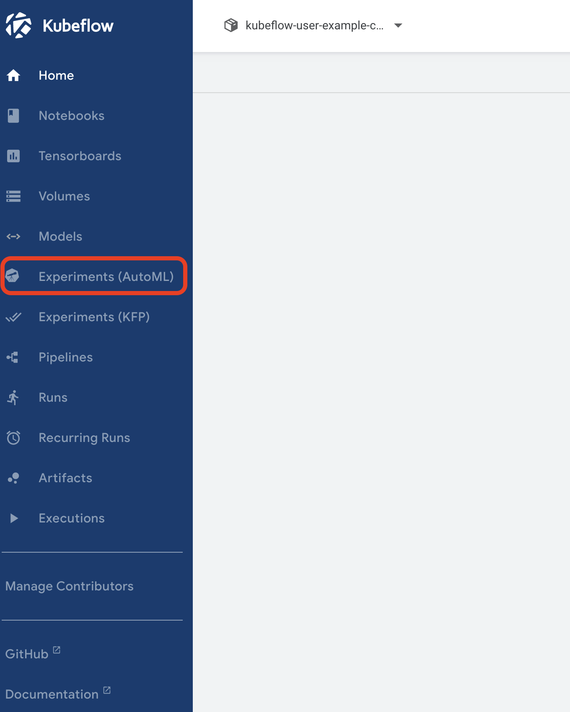
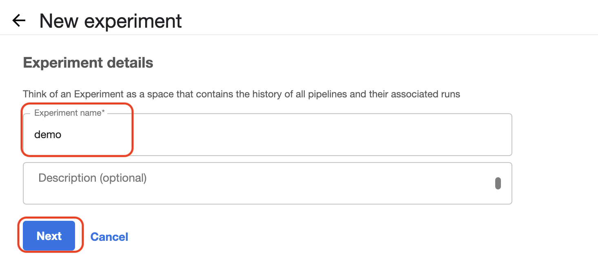
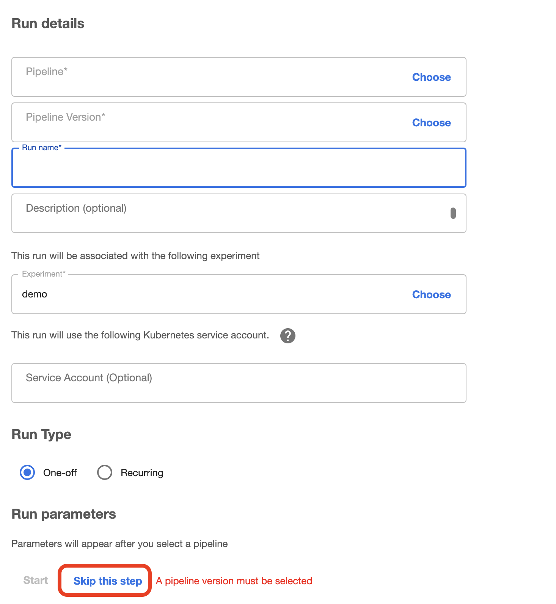
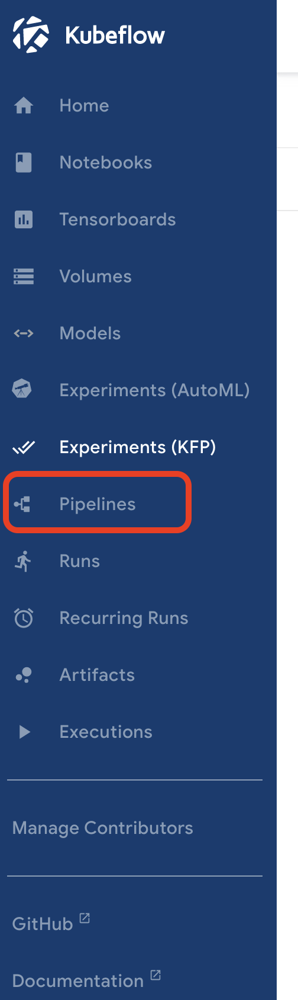
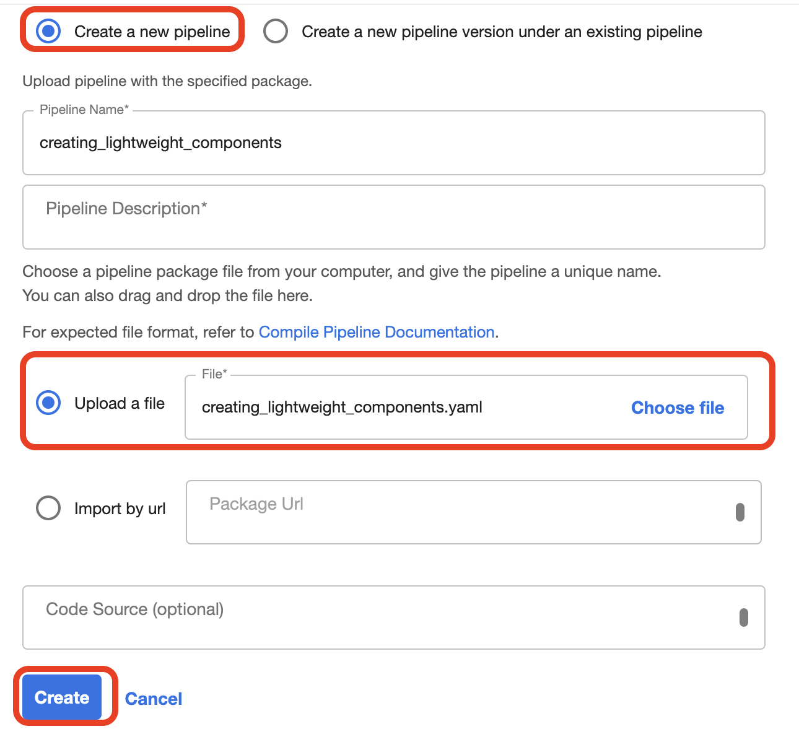
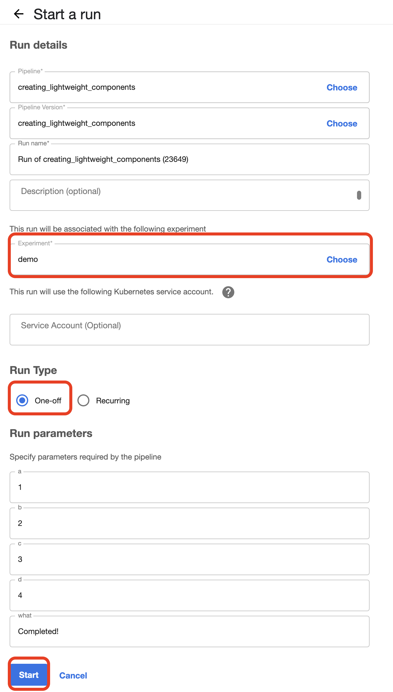
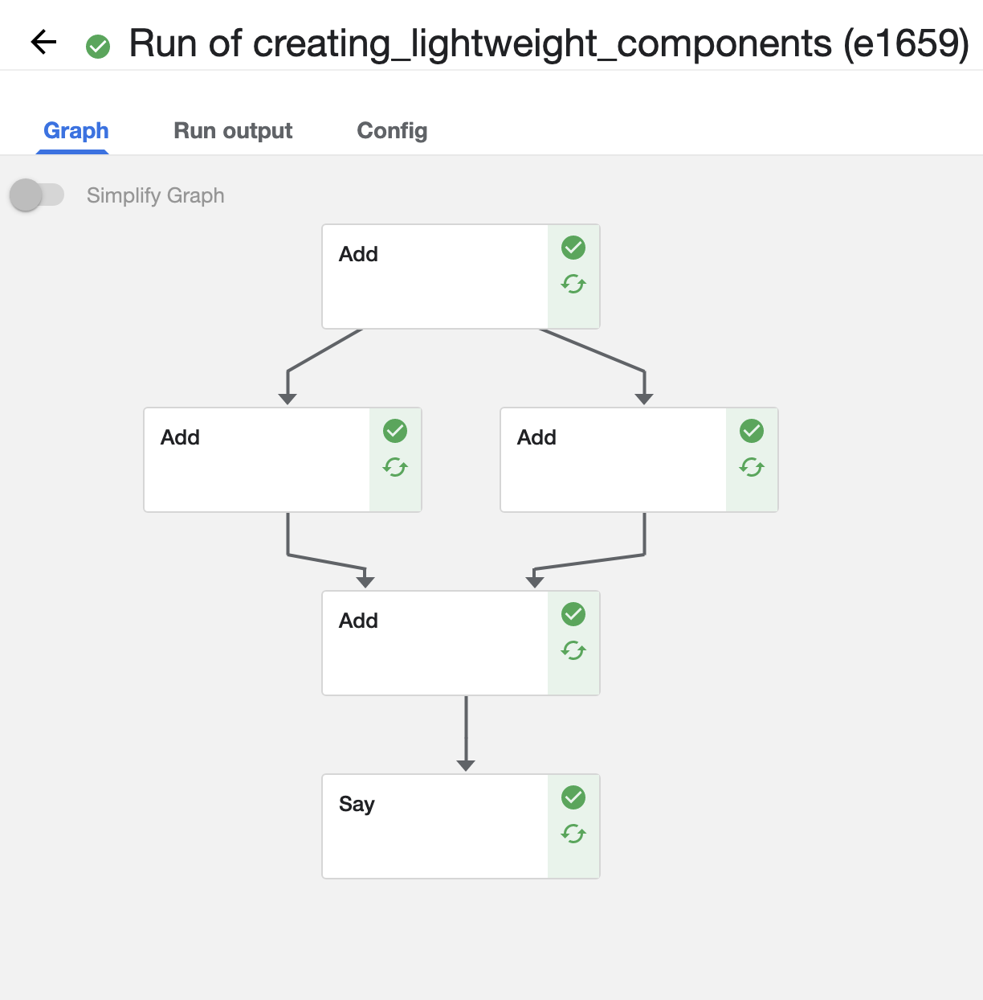

# 機械学習パイプラインの作成

## 1.資材

* creating_lightweight_components.yaml
    Kubeflowでのパイプラインの仕組みをシンプルに確認するためのManifest
* ocha_demo_tfx_pipeline.yaml
    TFX(Tensorflow Extended)を利用した機械学習パイプライン

※各パイプラインの細かい説明は割愛します。
（興味がある方はそれぞれ以下のJupyter Notebookを見てください)

* [creating_lightweight_components](../Jupyter_Notebook/creating_lightweight_components.ipynb)

* [ocha_demo_tfx_pipeline](../Jupyter_Notebook/ocha_demo_tfx_pipeline.ipynb)

## 2.パイプラインの作成手順(creating_lightweight_componentsの場合)

### 2-1.Experimentsの作成

Kubeflow Dashboardにアクセスし、`Experiments(KFP)`をクリックします。  

`Experiments(KFP)`は、Kubeflow Pipelineパイプラインにおける実行環境環境です。
パイプラインを実行するためには、この`Experiments(KFP)`に紐づける必要があります。  

上部にあるをクリックします。  

以下のように名前を入力します。今回は`demo`とし、`Next`をクリックします。  
これで、Experimentsが作成されます。  

### 2-2.Pipelineの作成

繊維先の画面はパイプラインの作成画面になっています。  
この画面は一旦スキップするために、`skip this step`をクリックします。  

次に、`Pipeline`をクリックします。

上部にあるをクリックします。

`Create a new pipieline`を選択し、`Upload a file`で本ディレクトリにあるManifestを選択します。  
(自動的に`Pipeline Name`も入力されます)

`Create`をクリックします。これでパイプラインが作成されます。

### 2-3.Pipelineの実行

上部のをクリックします。  

`Experiment`に先ほど作成した`demo`を選択、`Run Type`に`One-off`を選択します。  
定期実行したい場合は`Reccuring`を選択します。  

`Start`をクリックします。これでパイプラインが実行されます。  

以下のようになれば成功です。

これは、`creating_lightweight_components`の例ですが、`ocha_demo_tfx_pipeline`の場合でも同じ手順で実行できます。 
ただし、`ocha_demo_tfx_pipeline`を実行するには、別途事前準備が必要なので、[こちら](../Jupyter_Notebook/README.md)の手順を実行してください。

`ocha_demo_tfx_pipeline`を実行した場合は、MinIO上にモデルが作成されます。  
MinIOに格納されたモデルをKubernetes上にデプロイする方法は[こちら](../deploy_model/README.md)です。  

## 3.パイプラインの作成手順(ocha_demo_tfx_pipelineの場合)

### 3-1.Experimentsの作成

Kubeflow Dashboardにアクセスし、`Experiments(KFP)`をクリックします。  

`Experiments(KFP)`は、Kubeflow Pipelineパイプラインにおける実行環境環境です。
パイプラインを実行するためには、この`Experiments(KFP)`に紐づける必要があります。  

上部にあるをクリックします。  

以下のように名前を入力します。今回は`demo`とし、`Next`をクリックします。  
これで、Experimentsが作成されます。  

### 3-2. ocha_demo_tfx_pipelineの資材作成

`ocha_demo_tfx_pipeline`のパイプラインを実行するには、事前に先ほど構築したMinIOに必要な資材を作成しておく必要があります。  

