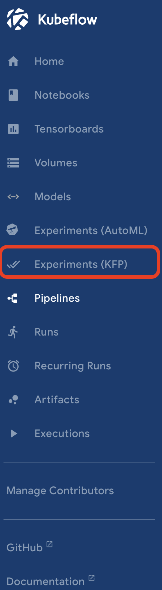

# 機械学習パイプラインの作成

## 1.資材

* creating_lightweight_components.yaml
    Kubeflowでのパイプラインの仕組みをシンプルに確認するためのManifest
* ocha_demo_tfx_pipeline.yaml
    TFX(Tensorflow Extended)を利用した機械学習パイプライン

※各パイプラインの細かい説明は割愛します。
（興味がある方はそれぞれ以下のJupyter Notebookを見てください)

* [creating_lightweight_components](../Jupyter_Notebook/creating_lightweight_components.ipynb)

* [ocha_demo_tfx_pipeline](../Jupyter_Notebook/ocha_demo_tfx_pipeline.ipynb)

## 2.パイプラインの作成手順(creating_lightweight_componentsの場合)

### 2-1.Experimentsの作成

Kubeflow Dashboardにアクセスし、`Experiments(KFP)`をクリックします。  

`Experiments(KFP)`は、Kubeflow Pipelineパイプラインにおける実行環境環境です。
パイプラインを実行するためには、この`Experiments(KFP)`に紐づける必要があります。  

上部にあるをクリックします。  

以下のように名前を入力します。今回は`demo`とし、`Next`をクリックします。  
これで、Experimentsが作成されます。  

繊維先の画面はパイプラインの作成画面になっています。  
この画面は一旦スキップするために、`skip this step`をクリックします。  

### 2-2.Pipelineの作成

`Pipeline`をクリックします。

上部にあるをクリックします。

`Create a new pipieline`を選択し、`Upload a file`で本ディレクトリにあるManifestを選択します。  
(自動的に`Pipeline Name`も入力されます)

`Create`をクリックします。これでパイプラインが作成されます。

### 2-3.Pipelineの実行

上部のをクリックします。  

`Experiment`に先ほど作成した`demo`を選択、`Run Type`に`One-off`を選択します。  
定期実行したい場合は`Reccuring`を選択します。  

`Start`をクリックします。これでパイプラインが実行されます。  

以下のようになれば成功です。

## 3.パイプラインの作成手順(ocha_demo_tfx_pipelineの場合)

### 3-1.Experimentsの作成

この手順は既に2.1でExperimentsを作成している場合はスキップしてください。

Kubeflow Dashboardにアクセスし、`Experiments(KFP)`をクリックします。  

`Experiments(KFP)`は、Kubeflow Pipelineパイプラインにおける実行環境環境です。
パイプラインを実行するためには、この`Experiments(KFP)`に紐づける必要があります。  

上部にあるをクリックします。  

以下のように名前を入力します。今回は`demo`とし、`Next`をクリックします。  
これで、Experimentsが作成されます。  

### 3-2. ocha_demo_tfx_pipelineの資材作成

`ocha_demo_tfx_pipeline`のパイプラインを実行するには、事前に先ほど構築したMinIOに必要な資材を作成しておく必要があります。  

まず、MinIOのコンソールにアクセスし、をクリック、`census-income`という名前のバケットを作成します。  

作成したバケットの`Browse`ボタンをクリックします。  

本ディレクトリにある`resource`ディレクトリ配下の資材を全ディレクトリ分、MinIOにアップロードします。
アップロードする際には、`resource`ディレクトリにある6つのディレクトリを選択し、ドラッグ&ドロップでMinIOにアップロードします。  
※一括でアップロードしようとするとディレクトリ構成が崩れるので、一つずつアップロードしてください。

これで資材作成は完了です。  

### 3-3. パイプライン定義の編集

ここでは、パイプラインに定義している環境固有の変数を編集します。  

パイプライン定義は本ディレクトリにある`ocha_demo_tfx_pipeline.yaml`です。  

編集する変数は以下の2つです。

* MinIOのアクセスキー(`s3_access_key_id`)
* MinIOのシークレットキー(`s3_secret_access_key`)

今回は、MinIOのアクセスキー(`s3_access_key_id`)を`<xxxxxxxxx>`、MinIOのシークレットキー(`s3_secret_access_key`)を`<yyyyyyyy>`とマスクしています。
それぞれを自身の環境に応じて変更してください。  

### 3-4.Pipelineの作成

`Pipeline`をクリックします。

上部にあるをクリックします。

`Create a new pipieline`を選択し、`Upload a file`で先ほど編集した`ocha_demo_tfx_pipeline.yaml`を選択します。  
(自動的に`Pipeline Name`も入力されます)

`Create`をクリックします。これでパイプラインが作成されます。

### 2-3.Pipelineの実行

上部のをクリックします。  

`Experiment`に先ほど作成した`demo`を選択(画像は異なります)、`Run Type`に`One-off`を選択します。  
定期実行したい場合は`Reccuring`を選択します。  

`Start`をクリックします。これでパイプラインが実行されます。  

少し時間がかかりますが、以下のようになれば成功です。　　
初回実行では、パイプラインの各ステップで利用するベースイメージが重いので、エラーになる可能性があります。　　
その場合は、再実行してください。

