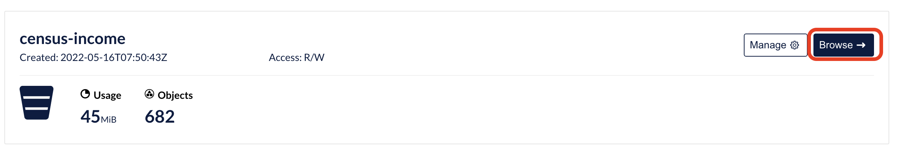
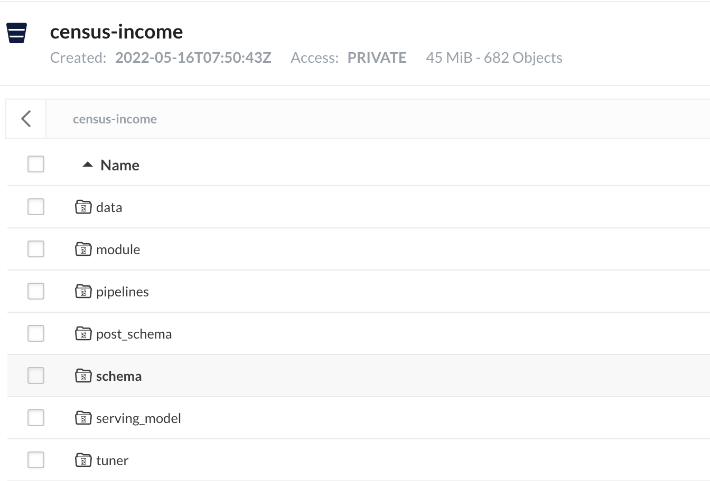
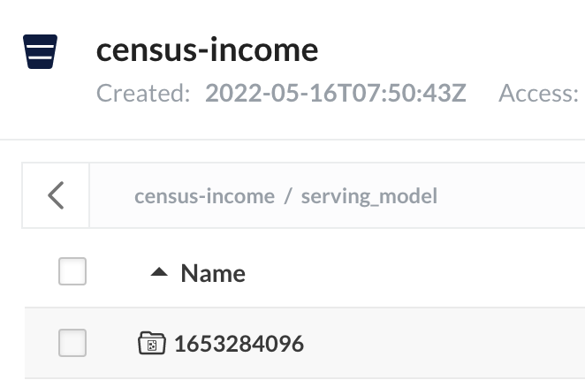
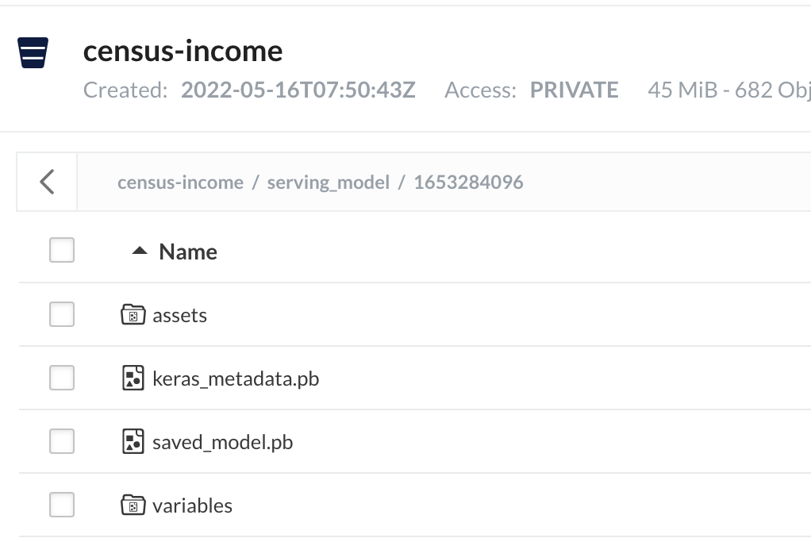
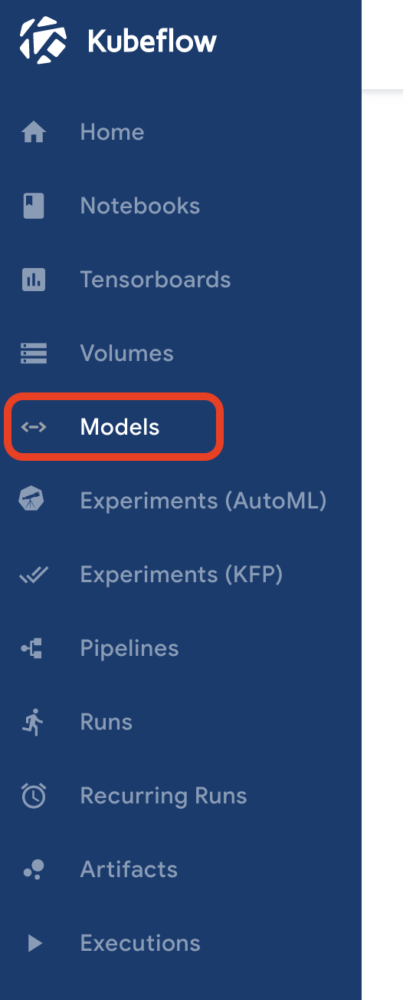
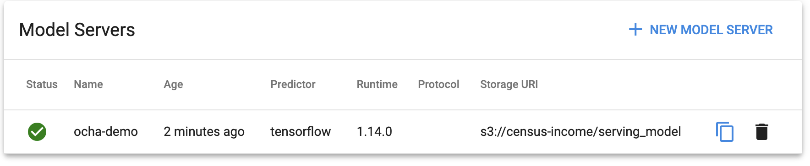
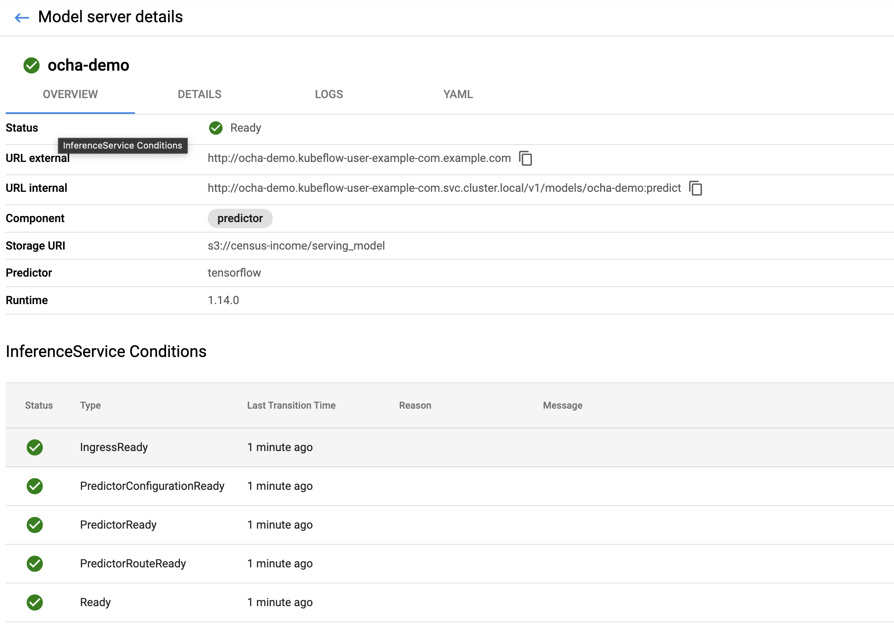

# モデルのデプロイ

ここでは、`ocha_demo_tfx_pipeline`パイプラインでMinIOに格納されたモデルをKubernetesクラスタ上にデプロイする方法を紹介します。  

## 1.格納されたモデルの確認

`ocha_demo_tfx_pipeline`パイプラインを実行すると、MinIOに`census-income`という名前のバケットが作成されています。  
MinIOへのアクセス方法は、[こちら](../README.md#2-2-minio-operatorおよびminioのインストール)で紹介しています。
`Browse`をクリックするとバケットの中身を確認できます。  



バケットの中身は以下のようになっています。  



`serving_model`というディレクトリに番号が付与されたディレクトリがあります。  



さらに中を掘っていくと、モデルのアセットが表示されます。  



このアセットをKubernetes上にモデルとしてデプロイします。  

## 2.格納されたモデルの確認

今回は、[Kserve](https://github.com/kserve/website/)という[Knative](https://github.com/knative/docs)ベースのサービングの仕組みを利用してデプロイします。  

まずは、KserveがMinIOにアクセスできるように、MinIOへのアクセス資格情報を持たせたSecretとサービスアカウントを作成します。  

```yaml
apiVersion: v1
kind: Secret
metadata:
  name: s3creds
  namespace: kubeflow-user-example-com
  annotations:
     serving.kserve.io/s3-endpoint: minio.default.svc.cluster.local # replace with your s3 endpoint e.g minio-service.kubeflow:9000
     serving.kserve.io/s3-usehttps: "0" # by default 1, if testing with minio you can set to 0
     serving.kserve.io/s3-region: "ap-northeast-1"
     serving.kserve.io/s3-useanoncredential: "false" # omitting this is the same as false, if true will ignore provided credential and use anonymous credentials
type: Opaque
stringData: # use `stringData` for raw credential string or `data` for base64 encoded string
  AWS_ACCESS_KEY_ID: xxxxxxxxxxxxxxxx
  AWS_SECRET_ACCESS_KEY: xxxxxxxxxxxxxxxxxxx
---
apiVersion: v1
kind: ServiceAccount
metadata:
  name: sa
  namespace: kubeflow-user-example-com
secrets:
- name: s3creds
---
```

```yaml
stringData: # use `stringData` for raw credential string or `data` for base64 encoded string
  AWS_ACCESS_KEY_ID: xxxxxxxxxxxxxxxx
  AWS_SECRET_ACCESS_KEY: xxxxxxxxxxxxxxxxxxx
```

この部分をMinIOのアクセスキーとシークレットキーに差し替えてください。  

Kubernetesに適用します。  

```sh
kubectl apply -f s3cred.yaml
```

これで、シークレットとサービスアカウントが作成されました。  

次に、Kserveをデプロイします。  

```yaml
apiVersion: "serving.kserve.io/v1beta1"
kind: "InferenceService"
metadata:
  name: "ocha-demo"
  namespace: kubeflow-user-example-com
spec:
  predictor:
    serviceAccountName: sa
    tensorflow:
      storageUri: "s3://census-income/serving_model"
```

```yaml
  predictor:
    serviceAccountName: sa
    tensorflow:
      storageUri: "s3://census-income/serving_model"
```

この部分でモデルの場所を指定しています。  

これを適用します。  

```sh
kubectl apply -f kserve.yaml
```

デプロイ状況を確認します。  

```sh
kubectl get InferenceService -n kubeflow-user-example-com
```

```sh
[opc@client ~]$ kubectl get InferenceService -n kubeflow-user-example-com
NAMESPACE                   NAME        URL                                                      READY   PREV   LATEST   PREVROLLEDOUTREVISION   LATESTREADYREVISION                 AGE
kubeflow-user-example-com   ocha-demo   http://ocha-demo.kubeflow-user-example-com.example.com   True           100                              ocha-demo-predictor-default-00001   6s
```

モデルのデプロイ状況はKubeflow Dashboardからも確認できます。  

Kubeflow Dashboardメニューのの`Model`をクリックします。  



モデル一覧に先ほどデプロイしたモデルが表示されます。  



モデルをクリックすると、以下のような情報を参照できます。  


