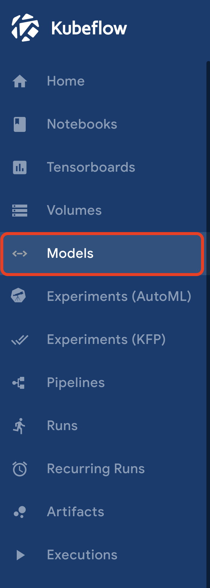
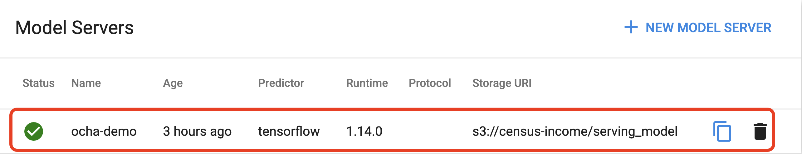
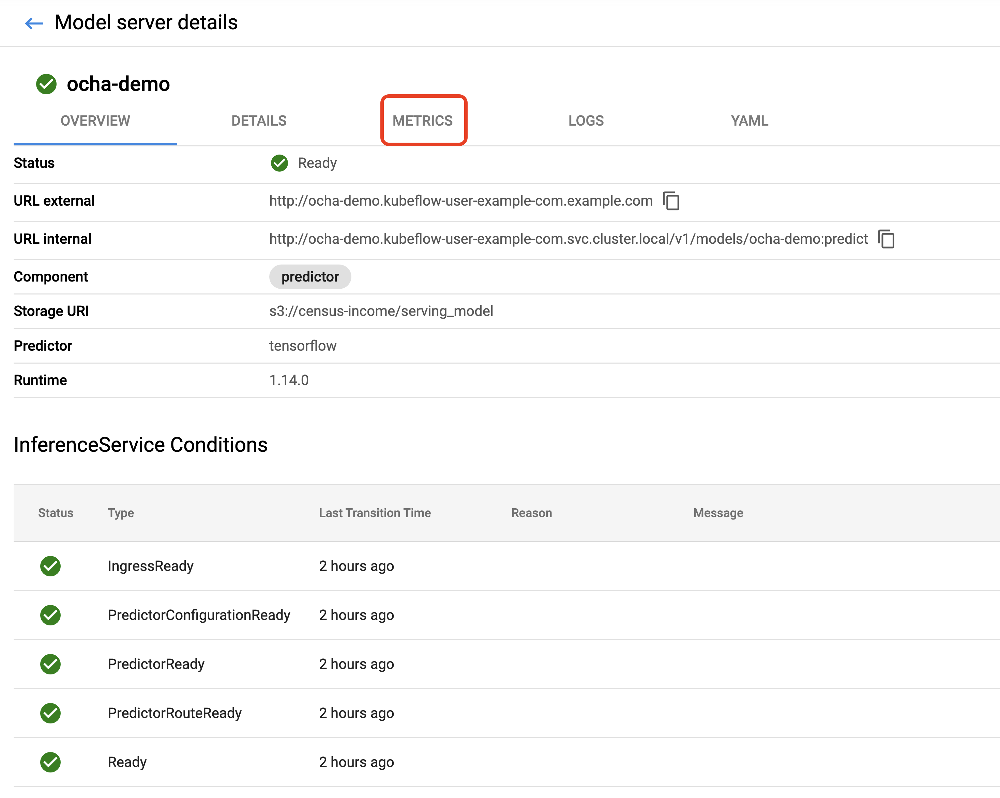
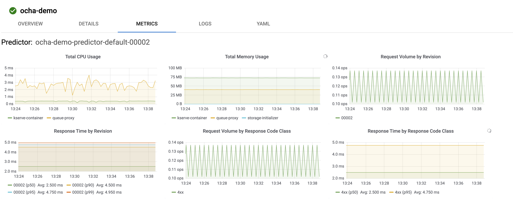

# モデルのメトリクス監視

ここでは、[モデルのデプロイ](../deploy_model/README.md)でデプロイしたモデルのメトリクス監視を実施します。  

## 1. PrometheusとGrafanaのインストール

PrometheusとGrafanaはKServeの[レポジトリにあるManifest](https://github.com/knative/serving/releases/tag/v0.18.0)からインストールできます。  
今回は、本レポジトリに用意しているので、適用します。　　

```sh
kubectl apply -f knative_monitoring.yaml
```

## 2. Kubeflowダッシュボード(Model UI)にGrafanaダッシュボードを埋め込む

先ほどデプロイしたGrafanaのダッシュボードをKubeflowダッシュボード(Model UI)から確認できるようにする設定をしていきます。  

```sh
kubectl apply -f knative_monitoring_config.yaml
```

## 3. 動作確認

Kubeflowダッシュボード(Model UI)を開きます。



`ocha-demo`をクリックします。  



`METRICS`タブを開きます。



メトリクスが確認できます。



初回表示の場合は、少し時間がかかる可能性があります。  

`METIRCS`タブが表示されない場合は、Grafanaが適用したConfigMapを読み込めていない可能性があるので、Podを再起動します。  

```sh
kubectl rollout restart deployment/grafana -n knative-monitoring
```
